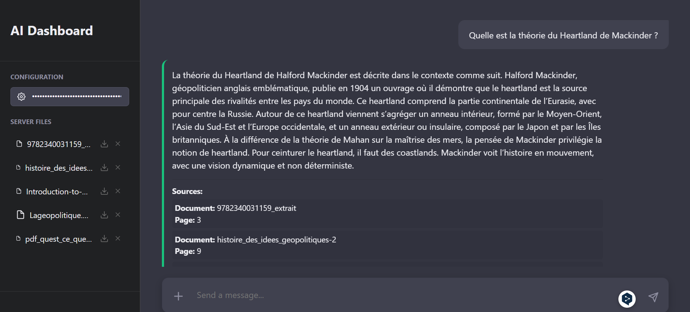
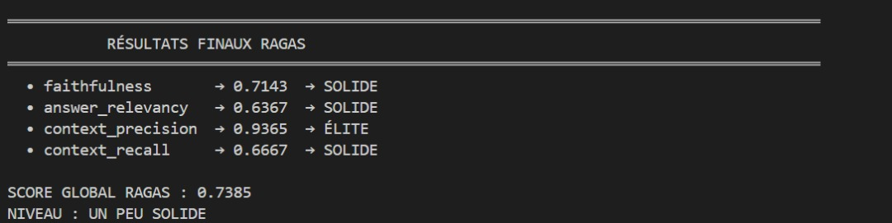

# NLP-RAG-SDD - Chatbot Géopolitique

Un assistant conversationnel intelligent spécialisé en géopolitique, utilisant la technologie RAG (Retrieval-Augmented Generation) pour fournir des réponses précises basées sur des documents académiques.



## 📋 Table des matières

- [Aperçu](#aperçu)
- [Fonctionnalités](#fonctionnalités)
- [Architecture](#architecture)
- [Prérequis](#prérequis)
- [Installation](#installation)
- [Utilisation](#utilisation)
- [Configuration](#configuration)
- [Exemples de questions](#exemples-de-questions)
- [Troubleshooting](#troubleshooting)
- [Licence](#licence)

## 🎯 Aperçu

Ce projet implémente un système RAG (Retrieval-Augmented Generation) permettant de poser des questions sur la géopolitique et d'obtenir des réponses contextualisées extraites de documents PDF académiques. Le système utilise :

- **Backend** : Flask + LangChain + ChromaDB
- **Frontend** : React
- **LLM** : Grok 4.1 (via OpenRouter)
- **Embeddings** : BAAI/bge-base-en-v1.5
- **Vectorstore** : ChromaDB

## ✨ Fonctionnalités

- 📚 **Indexation intelligente** de documents PDF avec chunking optimisé
- 🔍 **Recherche sémantique** dans les documents avec scoring de pertinence
- 💬 **Réponses contextualisées** basées uniquement sur les documents fournis
- 📖 **Citations des sources** avec référence exacte (document + page)
- 🎨 **Interface moderne** et intuitive
- ⚡ **API REST** pour intégration facile
- 🔐 **Gestion sécurisée** des clés API

## 📊 Performance et Évaluation

Le système a été évalué avec le framework **RAGAS** (Retrieval-Augmented Generation Assessment) sur un dataset de questions géopolitiques. Voici les résultats :



### Métriques RAGAS

| Métrique | Score | Niveau |
|----------|-------|--------|
| **Faithfulness** | 0.7143 | SOLIDE |
| **Answer Relevancy** | 0.6367 | SOLIDE |
| **Context Precision** | 0.9365 | ÉLITE |
| **Context Recall** | 0.6667 | SOLIDE |

**Score Global RAGAS : 0.7385** → **UN PEU SOLIDE**

### Interprétation des résultats

- ✅ **Context Precision (0.9365)** : Le système excelle dans la sélection des chunks pertinents
- ✅ **Faithfulness (0.7143)** : Les réponses sont généralement fidèles aux documents sources
- ⚠️ **Answer Relevancy (0.6367)** : Les réponses sont pertinentes mais peuvent être améliorées
- ⚠️ **Context Recall (0.6667)** : Le système récupère la plupart des informations nécessaires

Ces résultats démontrent que le système RAG fournit des réponses fiables et bien contextualisées, avec une excellente précision dans la sélection des sources.

## 🏗️ Architecture

```
NLP-RAG-SDD/
├── app.py                    # Serveur Flask (Backend API)
├── rag_llm.py               # Logique RAG principale
├── Indexation.py            # Indexation et embedding des documents
├── doc_search.py            # Retriever avec scoring
├── config.yaml              # Configuration du système
├── pyproject.toml           # Dépendances Poetry
├── data/                    # Documents PDF à indexer
├── vectorstore/             # Base de données vectorielle
└── front/                   # Application React
    ├── src/
    ├── package.json
    └── ...
```

## 📦 Prérequis

- **Python** : 3.12+
- **Node.js** : 16+ et npm
- **Poetry** : Gestionnaire de dépendances Python
- **Système d'exploitation** : Windows, macOS, Linux

### Installation de Poetry

**Linux, macOS, Windows (WSL)**

```bash
curl -sSL https://install.python-poetry.org | python3 -
```

**Windows (PowerShell)**

```powershell
(Invoke-WebRequest -Uri https://install.python-poetry.org -UseBasicParsing).Content | py -
```

## 🚀 Installation

### 1. Cloner le projet

```bash
git clone <votre-repo>
cd NLP-RAG-SDD
```

### 2. Installer les dépendances Python

```bash
poetry install
```

### 3. Installer les dépendances Frontend

```bash
cd front
npm install
cd ..
```

## 💻 Utilisation

### Étape 1 : Activer l'environnement virtuel Poetry

Ouvrez un premier terminal et exécutez :

```bash
poetry env activate
```

Vous obtiendrez un chemin d'activation similaire à :

```
"C:\Users\VotreNom\AppData\Local\pypoetry\Cache\virtualenvs\rag-sdd-o3zbxwJe-py3.12\Scripts\activate.bat"
```

**Copiez et collez ce chemin dans votre terminal** pour activer l'environnement.

Vous verrez alors le préfixe :

```
(rag-sdd-py3.12) C:\Users\VotreNom\...\NLP-RAG-SDD>
```

### Étape 2 : Lancer le Backend

Dans le même terminal (environnement activé) :

```bash
python app.py
```

Vous devriez voir :

```
* Running on http://127.0.0.1:5000
* Debug mode: on
```

✅ **Le backend est maintenant actif !**

### Étape 3 : Lancer le Frontend

Ouvrez un **second terminal** et naviguez vers le dossier frontend :

```bash
cd front
npm install  # Si ce n'est pas déjà fait
npm run dev
```

Vous verrez :

```
  ➜  Local:   http://localhost:5173/
```

✅ **L'interface est accessible !**

### Étape 4 : Utiliser l'application

1. **Ouvrez votre navigateur** à l'adresse : `http://localhost:5173/`
2. **Entrez votre clé API OpenRouter** dans le champ de configuration de l'interface :

   Pour obtenir votre clé API gratuite, rendez-vous sur [openrouter.ai](https://openrouter.ai) et créez un compte.

   **Clé de démonstration fournie** :

   ```
   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
   ```
3. **Uploadez vos documents PDF** (optionnel si des documents existent déjà dans `/data`)
4. **Posez vos questions** sur la géopolitique !

### Exemple de question

```
Quelle est la théorie du Heartland de Mackinder ?
```

**Réponse attendue** :

```
La théorie du Heartland de Halford Mackinder est décrite dans le contexte comme suit.
Halford Mackinder, géopoliticien anglais emblématique, publie en 1904 un ouvrage où
il démontre que le heartland est la source principale des rivalités entre les pays du
monde. Ce heartland comprend la partie continentale de l'Eurasie, avec pour centre
la Russie...

Sources:
Document: 9782340031159_extrait
Page: 3

Document: histoire_des_idees_geopolitiques-2
Page: 9
```


## ⚙️ Configuration

Le fichier `config.yaml` permet de personnaliser le comportement du système :

### Paramètres de chunking

```yaml
chunk_size: 1200        # Taille des chunks de texte
chunk_overlap: 300      # Chevauchement entre chunks
```

### Modèle LLM

```yaml
llm:
  model: x-ai/grok-4.1-fast:free
  temperature: 0.2      # Créativité (0 = déterministe, 1 = créatif)
  max_tokens: 2048      # Longueur max de réponse
```

### Retriever

```yaml
retriever:
  k: 15                 # Nombre de chunks récupérés
  threshold: 0.68       # Seuil de pertinence (cosine distance)
```

## 📚 Exemples de questions

Voici quelques questions que vous pouvez poser au chatbot :

- Quelle est la théorie du Heartland de Mackinder ?
- Qu'est-ce que la géopolitique selon Yves Lacoste ?
- Quelles sont les différences entre géopolitique et géostratégie ?
- Expliquez la théorie du Rimland de Spykman
- Quel est le rôle de la géographie dans les conflits internationaux ?

### 💡✨ Étape 2-3 : Pour lancer le frontend et le backend d'un coup:
```
python cli.py dev
```

## 🔧 Troubleshooting

### Problème : "API key not found"

**Solution** : Vérifiez que vous avez bien entré la clé API dans le champ de configuration de l'interface web. La clé doit être saisie à chaque démarrage de l'application.

### Problème : "Vectorstore not found"

**Solution** : Indexez vos documents d'abord :

```bash
python indexation.py
```

### Problème : Port 5000 déjà utilisé

**Solution** : Modifiez le port dans `app.py` :

```python
app.run(debug=True, port=5001)  # Utilisez 5001 au lieu de 5000
```

### Problème : Erreur npm/node

**Solution** : Vérifiez votre version de Node.js :

```bash
node --version  # Devrait être 16+
npm --version
```

### Problème : "Module not found"

**Solution** : Réinstallez les dépendances :

```bash
poetry install
cd front && npm install
```

## 📁 Ajouter vos propres documents

1. Placez vos fichiers PDF dans le dossier `/data`
2. Relancez l'indexation :
   ```bash
   python indexation.py
   ```
3. Les nouveaux documents seront automatiquement intégrés au vectorstore

## 🎓 Technologies utilisées

- **LangChain** : Framework RAG
- **ChromaDB** : Base de données vectorielle
- **HuggingFace Transformers** : Embeddings
- **Flask** : API Backend
- **React** : Interface utilisateur
- **OpenRouter** : Accès au modèle Grok
- **Poetry** : Gestion des dépendances Python

## 📄 Licence

Ce projet est sous licence MIT. Voir le fichier [LICENSE](LICENSE) pour plus de détails.

## 🙏 Remerciements

- Documents géopolitiques fournis par diverses sources académiques
- Communauté LangChain pour le framework RAG
- OpenRouter pour l'accès à Grok

---

**⭐ Si ce projet vous a été utile, n'hésitez pas à lui donner une étoile !**
